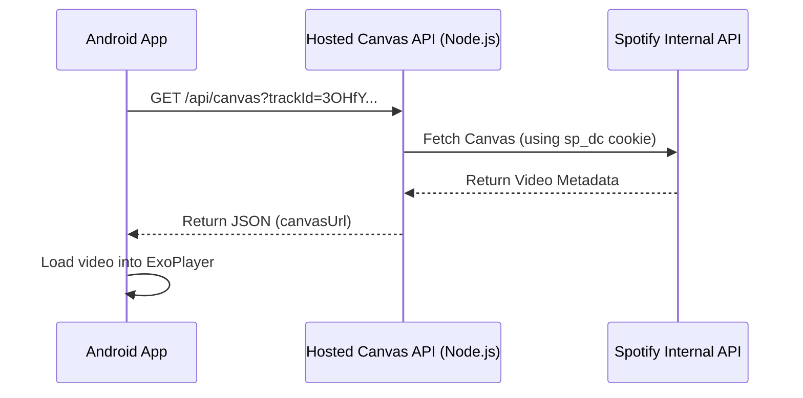

# Spotify Canvas API Research

The [Spotify-Canvas-API](https://github.com/Paxsenix0/Spotify-Canvas-API) is a Node.js wrapper that allows you to fetch the "Canvas" (short looping background videos) for any Spotify track.

## How it Works
1.  **Backend Requirement**: The API is written in Node.js/Next.js. It cannot run directly inside your Android app. You must host it on a server (e.g., Vercel, Railway, or a VPS).
2.  **Authentication**: It uses a `sp_dc` cookie from a real Spotify account to authenticate with Spotify's internal servers.
3.  **Endpoint**: Once hosted, you call `GET /api/canvas?trackId=XYZ`.
4.  **Response**: It returns a JSON object containing the `canvasUrl` (a direct link to an `.mp4` file).

## Requirements for Integration
To use this in **ProjectMusic**, you will need:
- [ ] **A hosted instance** of this API.
- [ ] **A Spotify `sp_dc` cookie** (found in browser developer tools after logging into Spotify).
- [ ] **Spotify Track IDs** for your songs. Since your app uses local files, we need a way to link a local song to its Spotify counterpart (e.g., via a "Spotify ID" field in the metadata).
- [ ] **Video Player**: Integration into the existing `VibrantCanvasPlayerFragment` to play the remote URL instead of a local file.

## Technical Architecture

> [!WARNING]
> This uses **undocumented Spotify endpoints**. Spotify could change their internal API at any time, which would break this implementation. It also technically violates Spotify's Terms of Service.

> [!TIP]
> **Privacy Note**: The `sp_dc` cookie is tied to a specific account. If you share your hosted API publicly, others will be using your account's session to fetch canvases.
